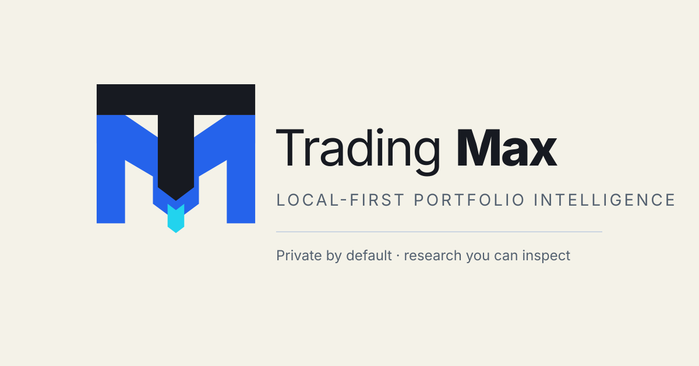
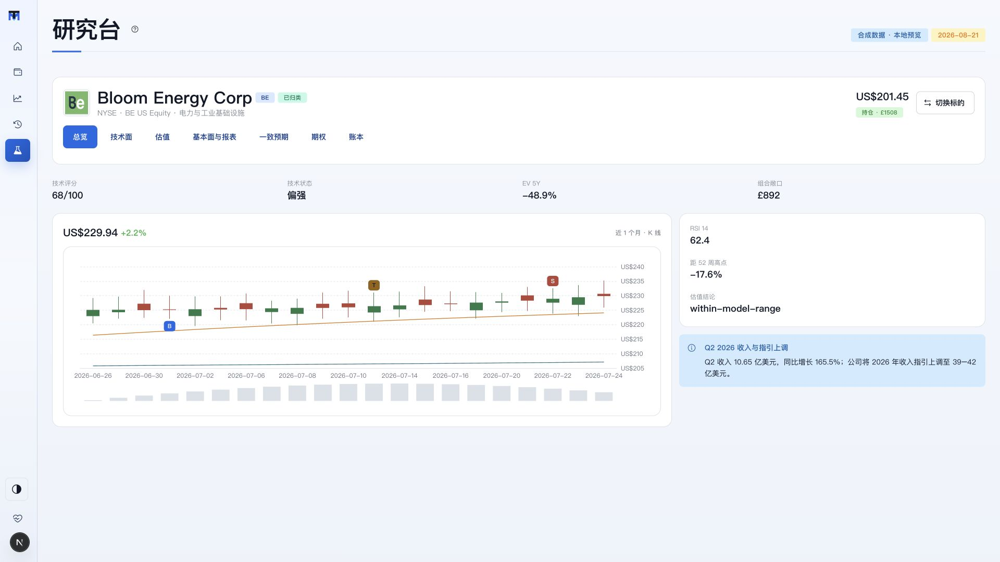

<p align="center">
  
</p>

<h1 align="center">Trading Max</h1>

<p align="center">
  <strong>Your Trading 212 portfolio, performance, holdings, and research in one private workspace.</strong>
</p>

<p align="center">
  <a href="https://github.com/engramai-co/trading-max/releases/latest"></a>
  <a href="https://github.com/engramai-co/trading-max/actions/workflows/ci.yml"></a>
  <a href="LICENSE"></a>
  
  
</p>

<p align="center">
  <a href="#install-with-codex">Install</a> ·
  <a href="#what-you-get">Features</a> ·
  <a href="docs/installation/local-installation.md">Installation guide</a> ·
  <a href="SUPPORT.md">Support</a> ·
  <a href="CONTRIBUTING.md">Contribute</a>
</p>

Trading Max turns read-only Trading 212 data into a portfolio you can inspect:
actual profit and loss, cash-flow-aware returns, ETF look-through, allocation,
risk, and per-security research. It runs on your computer, keeps credentials in
your operating system's credential store, and never places trades.

<p align="center">
  
</p>

<p align="center"><sub>Research overview shown with synthetic sample data.</sub></p>

## Install with Codex

Clone the repository and open the folder in Codex:

```bash
git clone https://github.com/engramai-co/trading-max.git
cd trading-max
```

Then ask Codex:

```text
Set this project up completely for local use.
```

Codex installs and verifies the app, then opens Settings. Enter your own
read-only Trading 212 credentials there—not in chat—and run the first refresh.

## Install manually

You need macOS 13+, Git, Python 3.12, [uv](https://docs.astral.sh/uv/), and
Node.js 22 LTS.

```bash
git clone https://github.com/engramai-co/trading-max.git
cd trading-max
uv run --package trading-max-backend trading-max onboard
```

The guided installer builds the app, stores its state outside the repository,
and opens the local dashboard. For later foreground starts:

```bash
deploy/local/start.sh
```

Trading Max is available at [http://127.0.0.1:3413](http://127.0.0.1:3413).
See the [installation guide](docs/installation/local-installation.md) for Linux,
Windows preview, custom state locations, background services, and recovery.

## What you get

- **One portfolio view** — combine Invest and Stocks ISA accounts while keeping
  account-level detail available.
- **Performance you can explain** — actual P&L, cash-flow-aware TWR, drawdown,
  and market benchmark comparisons.
- **Holdings beneath the ticker** — direct positions, ETF look-through,
  countries, sectors, GICS classifications, and concentration.
- **Seven research lenses** — overview, technicals, valuation, fundamentals,
  estimates, financials, and options, including real trade markers where data
  is available.
- **Recoverable local data** — immutable snapshots, visible refresh health,
  backups, and safe restore.

Optional model providers can add narrative synthesis. Portfolio ingestion,
analytics, and the research workspace remain usable without an LLM key.

## Private and read-only by design

- Trading Max requests read-only broker access and has no order-placement path.
- Credentials stay in Keychain or the platform credential manager.
- Portfolio state, logs, snapshots, and provider responses stay outside Git.
- The web app and API listen on loopback by default.
- A failed refresh cannot replace the last valid snapshot.

V1 is a local, single-user application with macOS as its first-class platform.
It is not a hosted service and does not provide investment, tax, legal,
brokerage, or uptime advice. Read [Privacy](PRIVACY.md), [Security](SECURITY.md),
and [Support](SUPPORT.md) before using real account data.

## Project links

- [Installation and first refresh](docs/installation/local-installation.md)
- [Provider and data-source notices](THIRD_PARTY_NOTICES.md)
- [Contributing](CONTRIBUTING.md)
- [Changelog](CHANGELOG.md)
- [Licence](LICENSE) and [trademark policy](TRADEMARKS.md)

Trading Max is open source under the Apache License 2.0. It is not affiliated
with or endorsed by Trading 212, Yahoo, Bloomberg/OpenFIGI, any ETF issuer, or
any model provider.
