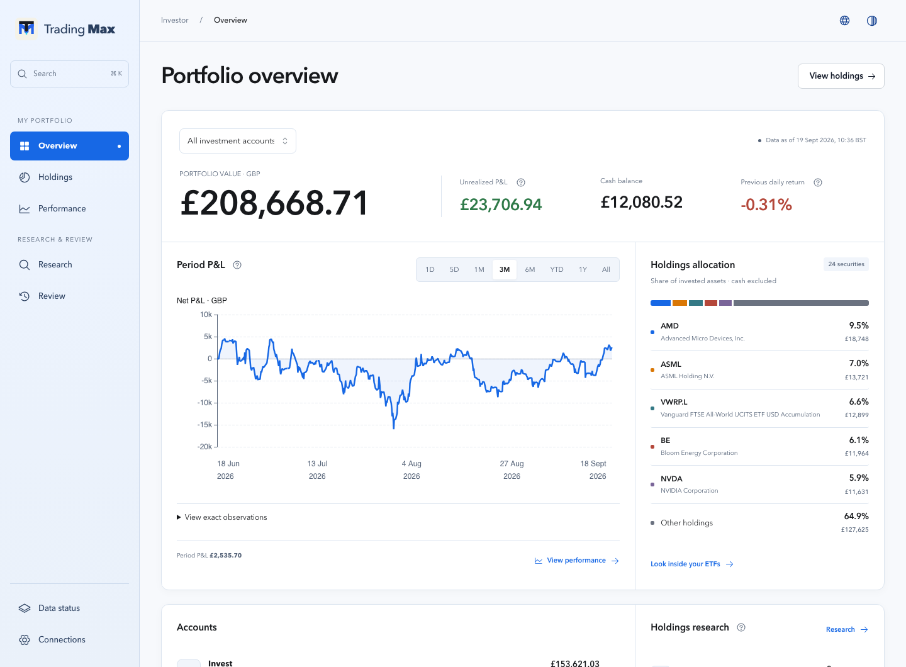
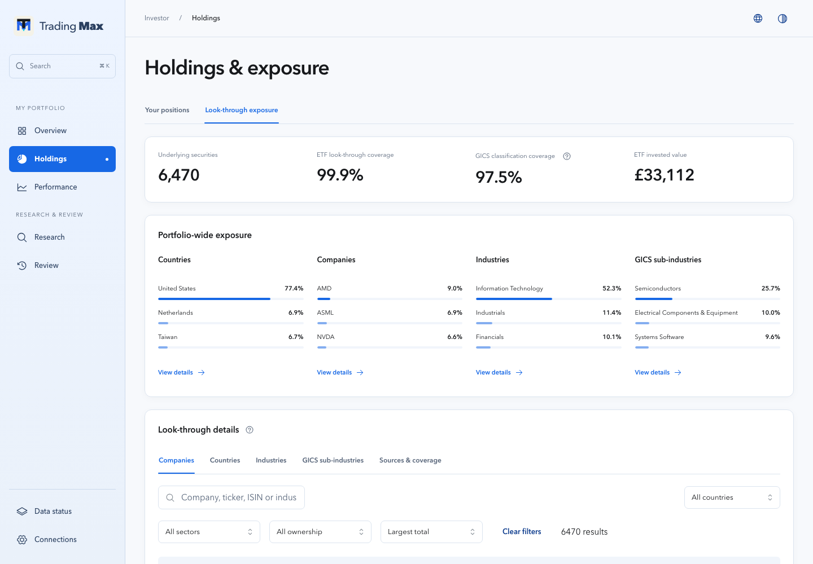
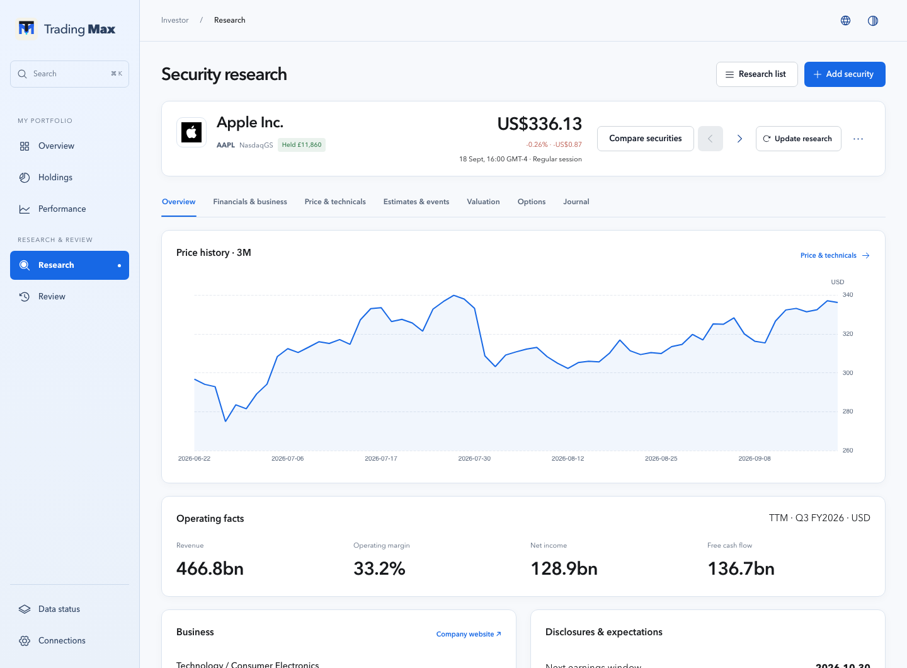
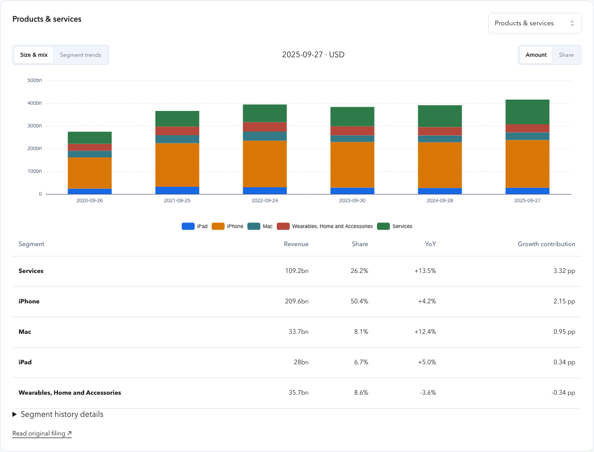
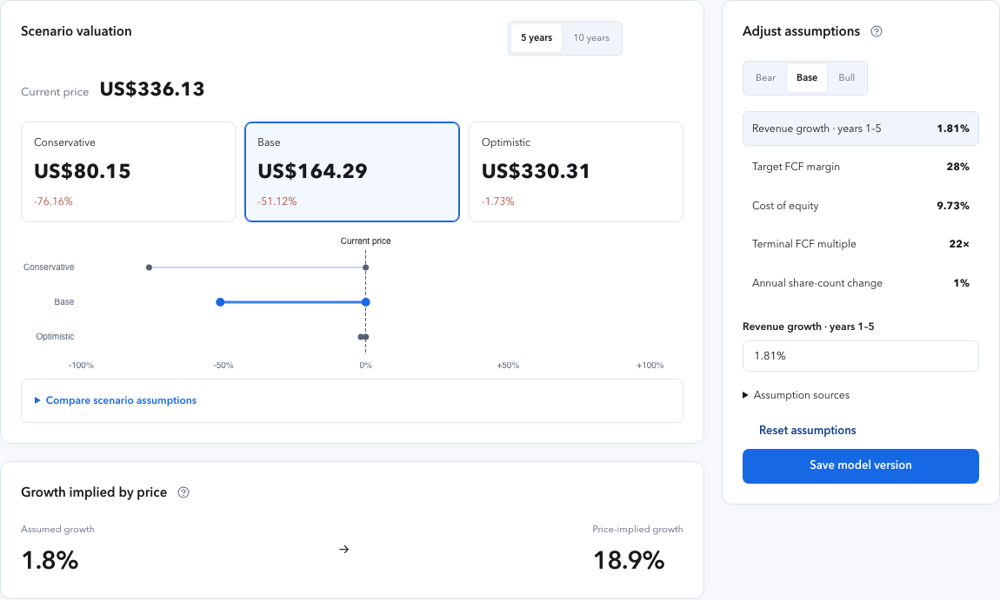

<p align="center"></p>

<h1 align="center">Your portfolio, explained.</h1>

<p align="center">
  <strong>Trading Max</strong> is a private workspace for your Trading 212 accounts.<br>
  Understand performance, look through your holdings, and research your next decision.
</p>

<p align="center">
  <a href="#get-started">Install Trading Max</a> ·
  <a href="#explore-the-workspace">Explore the workspace</a> ·
  <a href="docs/README.md">Read the guides</a>
</p>

<p align="center">
  <a href="https://github.com/engramai-co/trading-max/releases/latest"></a>
  <a href="LICENSE"></a>
  
</p>



## See what changed. Understand why.

**Separate investment results from money moving in and out.** Bring Invest and
Stocks ISA into one view, then inspect each account. Follow account value,
net contributions, profit and loss, drawdown, and cash-flow-adjusted return
comparisons where the history supports them.

**Find what you actually own.** A fund ticker is only the beginning. Combine
direct holdings with supported ETF constituents to inspect company, sector,
country, and asset-class exposure—and see where your positions overlap.

**Put research beside your portfolio.** Move from a company's operating results
to its filings, expectations, valuation scenarios, and your own saved model.
Research a new security without rebuilding the portfolio dashboard.

## Explore the workspace

### Look beneath the fund name

Switch between positions and look-through exposure. Filter, sort, and open a
holding to follow it into company research. Coverage remains explicit when a
fund's underlying holdings cannot be resolved.



### Start with the business

A clear company overview leads into financial statements, margins, cash flow,
business segments, ownership, and dividends. Switch reporting periods, compare
segment trends, and inspect exact values and their source records.





### Make your assumptions visible

Compare conservative, base, and optimistic valuation scenarios. Change one
assumption at a time, inspect the annual projection and sensitivity, and save
a version with a reason. The model shows what your assumptions imply; analyst
targets remain a separate reference.



Price & technicals keeps the everyday chart simple, with a full chart for
deeper analysis. Separate technical-data and seasonality views keep readings
easy to find. Estimates, event history, supported option chains, and a research
journal complete the workspace.

*Screenshots use hypothetical Trading 212 accounts and transactions. Market
and company research come from real providers; pictured values are dated
examples, not live quotes. Company marks belong to their owners.*

## Get started

Trading Max runs locally. macOS 13+ is the supported first-class platform;
Linux desktop support is conditional and Windows support is a preview.

### With Codex

Clone the repository, open the folder in Codex, and ask it to complete setup:

```bash
git clone https://github.com/engramai-co/trading-max.git
cd trading-max
```

```text
Set this project up completely for local use.
```

Codex follows the included installation workflow, starts the app, and verifies
it. Enter and test your read-only Trading 212 credentials in local Settings.
Never paste credentials into chat. The included
[onboarding skill](.agents/skills/trading-max-onboard/SKILL.md) also distinguishes
an existing installation from a fresh one.

### Manually

With Git, Python 3.12, [uv](https://docs.astral.sh/uv/), and Node.js 22 LTS
installed, run this from the cloned repository:

```bash
uv run --package trading-max-backend trading-max onboard
```

The guided installer builds the app and offers provider setup. For subsequent
foreground starts:

```bash
deploy/local/start.sh
```

Open [http://127.0.0.1:3413](http://127.0.0.1:3413). Connect your accounts in
Connections and follow the first refresh in Data status. Setup is complete when
readiness succeeds and the account totals agree with your broker.

[Full installation guide →](docs/installation/local-installation.md)

## Your data, on your computer

- **Read-only accounts.** Trading Max has no order-placement path.
- **Private local state.** Credentials use the operating-system credential
  manager. Portfolio data, research, saved models, and backups live outside
  the source checkout. The app listens on loopback by default.
- **Real sources.** Trading 212 supplies account data; Yahoo-compatible market
  data and disclosure adapters supply research. Optional Alpaca data enhances
  supported US historical reconstruction, with YF retained as fallback.
  [Availability and history vary by provider](docs/guides/data-and-metrics.md).
- **Optional AI.** Portfolio analytics and research work without a model key.
  Configured model routes can add narrative analysis using bounded context.
- **Recoverable history.** A failed refresh keeps the last valid snapshot.
  Verified independent backups and retained macOS releases support recovery.
  Optional compact storage preserves original records, while charts load only
  the requested view and fetch exact history on demand.
  [Storage and recovery guide](docs/operations/storage-maintenance.md).

This is a local, single-user application. See [Privacy](PRIVACY.md) for provider
requests and storage, and [data conventions](docs/guides/data-and-metrics.md)
for valuation, return, and coverage limits.

<a id="documentation"></a>

## Find your next step

| I want to… | Start here |
|---|---|
| Understand my portfolio | [Portfolio guide](docs/guides/portfolio.md) |
| Research a company or use a valuation model | [Research guide](docs/guides/research.md) |
| Install, update, back up, or recover | [Installation and recovery](docs/installation/local-installation.md) |
| Understand the architecture or API | [Documentation index](docs/README.md) |
| Report a problem or contribute | [Support](SUPPORT.md) · [Contributing](CONTRIBUTING.md) |
| See what shipped | [Changelog](CHANGELOG.md) · [Releases](https://github.com/engramai-co/trading-max/releases) |

Trading Max is open source under the [Apache License 2.0](LICENSE).
It is not affiliated with or endorsed by Trading 212, Yahoo, Bloomberg/OpenFIGI,
ETF issuers, or model providers. See [third-party notices](THIRD_PARTY_NOTICES.md)
and [trademarks](TRADEMARKS.md).
